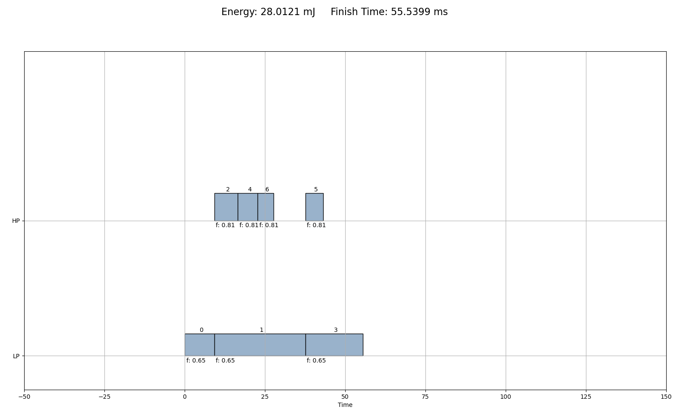
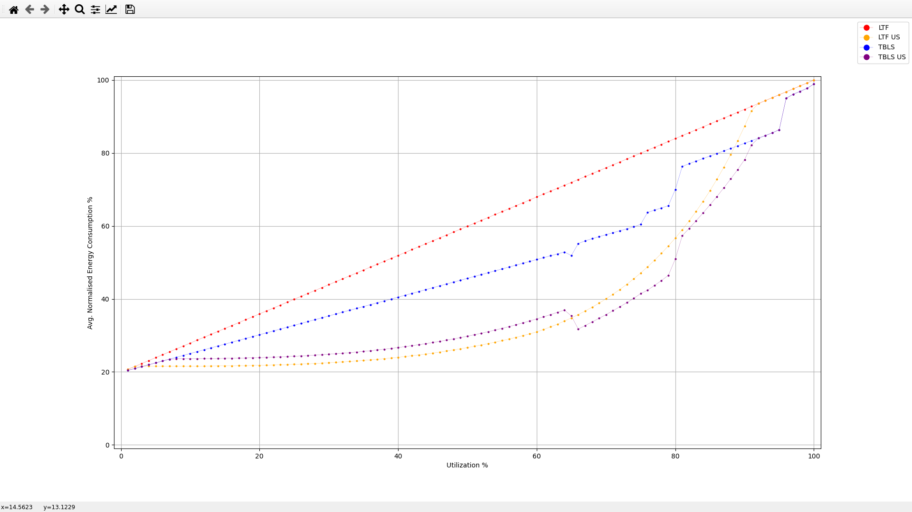

# Task Scheduling

## Progress

* [X] Implemented Largest Task First Scheduling
* [X] Implemented Threshold Based List Scheduling
* [X] Implemented Uniform Scaling
* [ ] Implemented Critical Path based Speed Scaling

## Contents

This archive includes:

* C++ Source Code used to generate the schedules and compute energy
* Python Scripts to plot the graph
* Task Data of a sample task with different total utilizations (100 in total, each the average of 1000 different random splits (with fixed sum))
> Task Data generation takes a long time using TGFF(~30 mins), which is why it is included

## How to execute

* Build the executables using GNU Make.
```shell
make run.o plot_data.o
```

### Plotting Individual Schedules

* ```run.o``` is the executable responsible for generating individual schedules
* To execute it run ```./run.o <tgff-file>```. For example,
```shell
./run.o task-graphs/example.tgff
# Runs the scheduler on the sample testcase
```
* By default, it generates 6 files:
```
ltf-schedule
ltf-schedule-cs
ltf-schedule-us

tbls-schedule
tbls-schedule-cs
tbls-schedule-us
```
>Here, *cs* is an abbreviation for **Contingency Schedule** and *us* for **Uniform Scaling**. No hyphen '-' means it is the default schedule generated.

> You should rename these files if you need them as running ```run.o``` again will overwrite them.

* All of these files can be visualized using the python script ```plot_schedule.py```. For example,
```shell
python3 plot_schedule.py < ltf-schedule-us
```


### Plotting Energy Curves
* ```plot_data.o``` is the executable responsible for generating energy information for each schedule
* To execute it run ```./plot_data.o <list of tgff-files>```. For example,
```shell
./plot_data.o task-graphs/graphs/*.tgff
# Runs the scheduler on the generated testcases
```
> Note, this will take some time (~10 seconds) and you might have to increase your stack limit temporarily using ```ulimit``` in Linux. I have included the generated files in case you are unable to.
* By default, it generates 1 file:
```
energy-plot
```
* To visualize this, use the script ```plot_energy_avg.py```. For example,
```shell
python3 plot_energy_avg.py energy-plot
```

